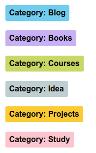
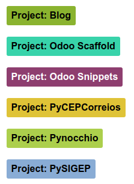
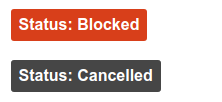

<h1 align="center">
 

 
Plano de Estudos
 
</h1>

<h4 align="center">Repositorios com materiais de estudo.</h4>

<b><a href="#introdução">Introdução</a></b>
|
<b><a href="#conteúdo">Conteúdo</a></b>
|
<b><a href="#roadmap">Roadmap</a></b>
|
<b><a href="#tarefas">Tarefas</a></b>
|
<b><a href="#projetos">Projetos</a></b>
|
<b><a href="#créditos">Créditos</a></b>

## Introdução

Este repositório contem projetos de teste desenvolvidos durante meus estudos. Estes projetos podem ser utilizados livremente, contudo nenhum deles está em um nível apropriado para ser utilizado em ambiente de produção.

## Conteúdo

Alguns códigos foram feitos durante o começo da minha graduação. 

| Diretório         | Descrição                                             |
| :---------------- | :---------------------------------------------------- |
| [Cpp](cpp/)       | projetos desenvolvidos utilizando a linguagem C e C++ |
| [Elixir](elixir/) | Projetos desenvolvidos utilizando a linguagem Elixir  |
| [Python](python/) | Projetos desenvolvidos utilizando a linguagem Python  |
| [Java](java/)     | projetos desenvolvidos utilizando a linguagem Java    |

## Roadmap

Como guia de estudos, estou utilizando o excelente *roadmap* disponível [aqui](https://github.com/kamranahmedse/developer-roadmap). Eu também adicionei em meus estudos livros sobre desenvolvimento pessoal (principalmente aqueles focados em desenvolvimento de software) e livros de literaruta comuns (afinal, ninguém é de ferro :smile:). O outros assuntos mais específicos como emulação, compactação, compiladores e linguagens de programação, também estão em meu *roadmap*.

## Tarefas

Este repositório tambem possui [issues](https://github.com/mstuttgart/plano-de-estudos/issues) relacionadas as tarefas do meu plano de estudos (cursos, livros, projetos "de estimação", blog e etc), para fins de organização. 

| Categoria             | Projeto                 | Status                 |
| :-------------------: | :---------------------: | :--------------------: |
|  |  |  |

## Projetos

Eu possuo um plano de estudos para cada [ano](https://github.com/mstuttgart/plano-de-estudos/projects) (começando por 2018). Todas as tarefas podem ser vistas [aqui](https://github.com/mstuttgart/plano-de-estudos/projects/1?fullscreen=true).

## Créditos

Copyright (C) 2018 by Michell Stuttgart
