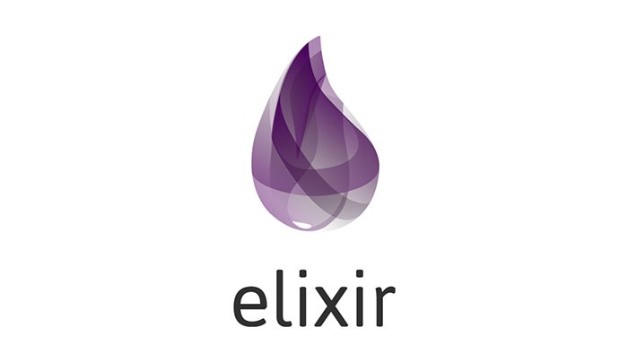

# Elixir

Testes e exemplos de código utilizando a linguagem funcional Elixir. 

* [student](student/): código de exemplo com cadastro de estudantes e media de suas notas.
* [calculadora](calculadora/): código de exemplo com implementação de uma calculadora utilizando TDD.

